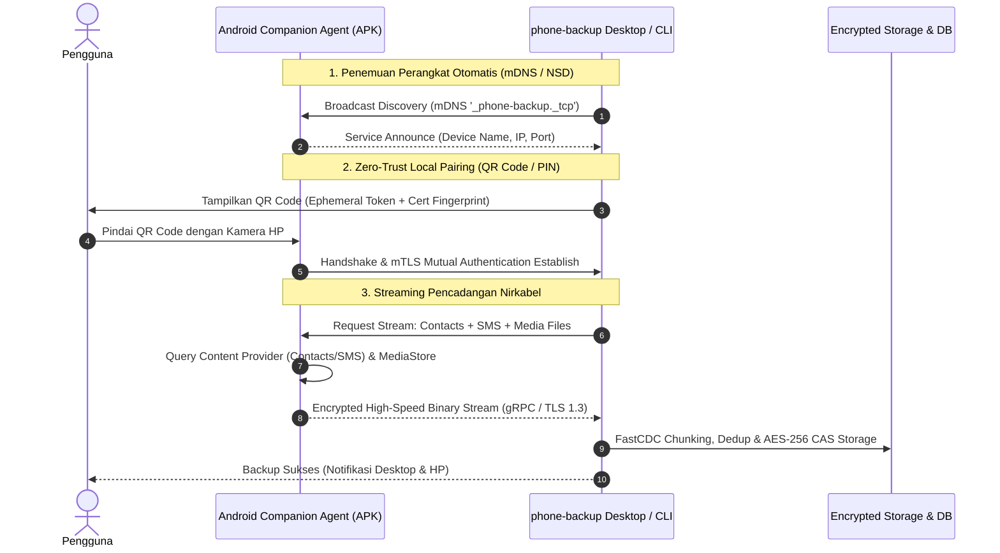
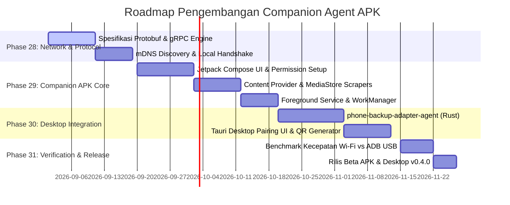

# 📱 Roadmap Arsitektur: Android Companion Agent APK (Wireless Zero-Debugging Backup)

Dokumen ini mendefinisikan cetak biru arsitektur (*architectural blueprint*) dan peta jalan (*roadmap*) pengembangan **Android Companion Agent APK** untuk platform **phone-backup**. Modul ini dirancang untuk memungkinkan pencadangan nirkabel berkecepatan tinggi melalui jaringan Wi-Fi lokal **100% tanpa memerlukan USB Debugging maupun kabel USB**.

---

## 🎯 1. Latar Belakang & Motivasi Arsitektur

Saat ini, platform `phone-backup` mengandalkan transport **ADB (Android Debug Bridge)** melalui kabel USB. Meskipun ADB memberikan kontrol tingkat rendah yang kuat, pendekatan ini memiliki friksi bagi pengguna umum:
1. **Kompleksitas Setup**: Pengguna harus mengaktifkan *Developer Options*, *USB Debugging*, dan *Security Settings*.
2. **Keterikatan Kabel**: Perangkat harus selalu terhubung secara fisik dengan kabel USB ke komputer.
3. **Keterbatasan MTP**: Tanpa USB Debugging, kabel USB biasa (MTP) memblokir pembacaan Kontak, SMS, dan Call Logs karena batasan keamanan *sandbox* Android.

**Solusi**: Membangun **Android Companion Agent APK** yang bertindak sebagai agen lokal di smartphone Android. Agen ini memanfaatkan **Android Runtime Permissions** standar untuk mengekstrak data dan berkomunikasi langsung dengan desktop engine via jaringan Wi-Fi lokal terenkripsi TLS 1.3.

---

## 🏗 2. Arsitektur Sistem Hexagonal & Integrasi Adapter

Berkat kepatuhan platform pada **Hexagonal Architecture (Ports & Adapters)**, penambahan agen nirkabel ini **tidak mengubah kode domain atau business logic inti (`core/`)**. Kami hanya menambahkan adapter baru: `phone-backup-adapter-agent`.

```text
phone-backup Ecosystem
├── apps/
│   ├── cli/                           # Desktop CLI
│   ├── gui/                           # Desktop GUI (Tauri)
│   └── android-agent/ [NEW]           # Kotlin + Jetpack Compose Android APK
├── core/
│   ├── domain/                        # Pure Domain Logic & Entities (Unchanged)
│   ├── application/                   # BackupService Pipeline (Unchanged)
│   └── ports/                         # DevicePort, ScannerPort, DataProviderPort
└── adapters/
    ├── adb/                           # Existing ADB Adapter
    ├── mock/                          # Existing Mock Adapter
    └── agent/ [NEW]                   # Remote gRPC/WebSocket Agent Adapter
```

---

## 🔄 3. Diagram Alur Kerja & Komunikasi Nirkabel (Data Flow)



---

## 🧩 4. Rincian Komponen Android Companion Agent APK

### A. Lapisan Frontend (Android UI)
- **Teknologi**: Kotlin + Jetpack Compose + Material 3.
- **Fitur Utama**:
  - **Quick Pair Screen**: Pemindai QR Code bawaan (*CameraX*) untuk pairing instan ke komputer.
  - **Status Dashboard**: Menampilkan status koneksi, baterai, suhu, dan kuota transfer.
  - **Selective Data Toggles**: Memilih kategori data yang diizinkan (Kontak, SMS, Panggilan, Galeri Foto, Dokumen).
  - **Live Transfer HUD**: Visualisasi kecepatan transfer real-time (MB/s).

### B. Lapisan Layanan Latar Belakang (Background Service)
- **Foreground Service**: Menjaga koneksi tetap hidup saat layar HP mati dengan notifikasi persisten.
- **WorkManager Integration**: Menjalankan sinkronisasi otomatis saat HP terhubung ke Wi-Fi rumah dan sedang dalam pengisian daya (*charging*).
- **Safety Monitor**: Menghentikan transfer otomatis jika baterai $< 15\%$ atau suhu baterai $> 45^\circ\text{C}$.

### C. Lapisan Transport & Jaringan (High-Performance Networking)
- **Protokol**: **gRPC over HTTP/2** atau **WebSocket over TLS 1.3** dengan zero-copy buffer streaming.
- **Discovery**: Network Service Discovery (Android NSD / Bonjour mDNS) untuk mendeteksi laptop di jaringan Wi-Fi lokal tanpa mengetik alamat IP secara manual.

---

## 🔒 5. Model Keamanan & Privasi (Zero-Trust Local Security)

1. **Mutual TLS (mTLS)**: Setiap koneksi antara komputer dan HP diautentikasi dengan sertifikat digital yang dibuat secara lokal (*self-signed ephemeral certificates*).
2. **PAKE (Password-Authenticated Key Exchange)**: Pemasangan awal diverifikasi menggunakan pertukaran kunci berbasis QR Code / PIN 6 digit untuk mencegah serangan *Man-in-the-Middle (MitM)* di jaringan Wi-Fi publik.
3. **Zero Cloud Dependency**: 100% data ditransfer langsung antar-perangkat di jaringan lokal (*Direct Local P2P*). Tidak ada data yang melewati server cloud pihak ketiga.
4. **Enkripsi End-to-End**: Data tetap dienkripsi dengan kunci master pengguna (**AES-256-GCM / age X25519**) sebelum ditulis ke media penyimpanan.

---

## 🚀 6. Peta Jalan Pengembangan (Phased Implementation Roadmap)



### 📅 Tahapan Rinci:

#### 🔹 Phase 28: Protokol Jaringan & Keamanan Pairing (Network & Security)
- [ ] Definisi skema kontrak data **Protocol Buffers (Protobuf)** untuk entitas File, Kontak, SMS, Call Logs, dan Heartbeat.
- [ ] Implementasi Network Service Discovery (**mDNS / NSD**) di Rust dan Android.
- [ ] Mekanisme pertukaran sertifikat TLS dan verifikasi QR Code Pairing.

#### 🔹 Phase 29: Pengembangan Android Agent APK (Client Core)
- [ ] Pembuatan modul `apps/android-agent/` dengan Kotlin & Jetpack Compose.
- [ ] Handler ekstraksi data Android Runtime:
  - `ContactsProviderExtractor.kt` (`content://com.android.contacts/data`)
  - `TelephonySmsExtractor.kt` (`content://sms/`)
  - `CallLogExtractor.kt` (`content://call_log/calls`)
  - `MediaStoreFileExtractor.kt` (Scoped Storage & MediaStore scraper).
- [ ] Foreground Service dengan notifikasi persisten dan manajemen wakelock.

#### 🔹 Phase 30: Desktop Adapter Engine (`phone-backup-adapter-agent`)
- [ ] Pembuatan crate baru `adapters/agent` di Rust yang mengimplementasikan:
  - `ports::DevicePort`
  - `ports::ScannerPort`
  - `ports::DataProviderPort`
  - `ports::AppProviderPort`
- [ ] Integrasi ke Desktop GUI (Tauri) untuk menampilkan generator QR Code Pairing dan status agen nirkabel.

#### 🔹 Phase 31: Optimalisasi Kinerja & Fitur Otomatisasi (Polish & Automation)
- [ ] Streaming I/O *Zero-Copy* untuk mencapai throughput Wi-Fi maksimal (> 50-80 MB/s pada Wi-Fi 5/6).
- [ ] Fitur **Auto-Sync on Charging**: Otomatis mem-backup saat HP terhubung ke Wi-Fi rumah dan sedang di-charge pada malam hari.
- [ ] Benchmark perbandingan kecepatan transfer Wi-Fi vs Kabel USB ADB.

---

## 📊 7. Matriks Perbandingan Fitur: ADB USB vs Companion Agent APK

| Fitur | 🔌 ADB USB Mode (Saat Ini) | 📱 Companion Agent APK (Roadmap) |
| :--- | :---: | :---: |
| **Kebutuhan Kabel USB** | Wajib | **100% Nirkabel (Wi-Fi)** |
| **Pengaturan Developer Mode** | Wajib (7x klik Build Number) | **Tidak Perlu (Izin Biasa)** |
| **Kecepatan Transfer** | 35 - 45 MB/s (USB 2.0) | 50 - 90 MB/s (Wi-Fi 6 / 5GHz) |
| **Backup Otomatis Latar Belakang** | Terbatas (perlu dicolok) | **Otomatis saat HP di-charge** |
| **Akses Kontak & SMS** | Perlu Security Setting (MIUI) | **Langsung (Izin Android Dialog)** |
| **Portabilitas Multi-Perangkat** | 1 HP per port USB | **Bisa sinkronisasi multi-device** |

---
*phone-backup Architecture Roadmap — Engineered with Rust, Clean Hexagonal Pattern, and Zero-Trust Security.*
