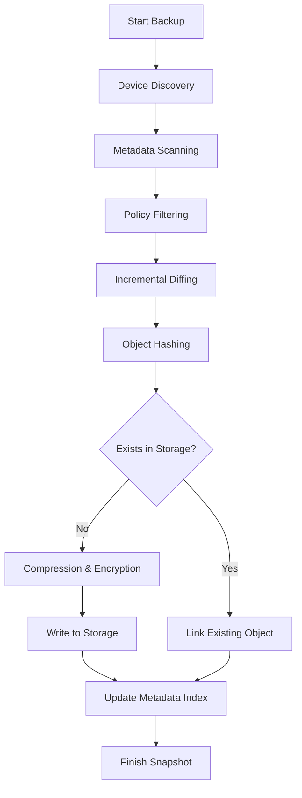

# 🏗 Software Architecture Document (SAD)

## 1. Introduction
This document describes the high-level architecture of the **phone-backup** platform. It is designed to be a secure, storage-efficient, and multi-transport backup engine for Android devices.

## 2. Architectural Goals
- **Decoupling**: Business logic must be independent of external transports (ADB) and storage (Disk/Cloud).
- **Security**: Data must be encrypted before leaving the device's volatile memory context.
- **Efficiency**: Identical files should only be stored once across all backups (Deduplication).
- **Reliability**: Backups must be resumable after any technical failure.

## 3. The Hexagonal Pattern
The system follows a strict **Hexagonal Architecture** (Ports & Adapters):

### 🧅 The Core (Domain & Application)
- **Domain**: Pure business entities (`Snapshot`, `Device`, `FileEntry`). No dependencies.
- **Application**: The `BackupService` orchestrates the backup pipeline. It depends only on **Ports**.

### 🔌 Ports (Interfaces)
- `DevicePort`: Abstraction for hardware communication.
- `StoragePort`: Abstraction for physical data persistence.
- `RepositoryPort`: Abstraction for metadata and indexing.
- `AppProviderPort`: Abstraction for APK management.

### ⚙️ Adapters (Implementations)
- `AdbDeviceAdapter`: Communicates with real devices.
- `LocalStorage`: Persists objects to the local filesystem.
- `CloudStorage (OpenDAL)`: Persists objects to S3/R2.
- `SqliteRepository`: Manages the metadata index.

---

## 4. Backup Pipeline (Data Flow)

---

## 5. Security Architecture
We implement a **Zero-Knowledge** capable security model:
1.  **Key Derivation**: User passwords are never stored. We use **Argon2id** with a salt to derive a 256-bit encryption key.
2.  **Encryption**: All data blobs are encrypted using **AES-256-GCM** (Authenticated Encryption).
3.  **Integrity**: The GCM authentication tag ensures that objects have not been tampered with or corrupted in storage.

---

## 6. Storage Strategy
### Content-Addressed Storage (CAS)
Objects are stored based on their SHA-256 hash.
- **Deduplication**: If two files have the same hash, they share the same physical object.
- **Path Sharding**: Objects are stored in subdirectories like `objects/ab/cd/...` to prevent directory performance degradation.

### Failure Recovery (Resume)
The engine tracks `Interrupted` snapshots in the `RepositoryPort`. Upon restarting, it identifies already-processed files by querying the partial snapshot manifest, allowing it to skip successful transfers and resume exactly where it left off.

---

## 7. Quality Attributes
- **Testability**: High. Every component is mockable via its Port.
- **Portability**: High. Written in Rust with minimal OS-specific dependencies (ADB being the primary external tool).
- **Extensibility**: Adding a new cloud provider or a new device type (e.g., iOS) only requires a new Adapter implementation.

---

## 8. Live File Operations & Security Architecture

### Live Device File Operations Pipeline
The GUI provides interactive, real-time file management for connected Android hardware:
- **Command Path**: Tauri Frontend (`snake_case` IPC calls) $\rightarrow$ Tauri Commands (`download_from_device`, `upload_to_device`, etc.) $\rightarrow$ `BackupService` (`download_file`, `upload_file`) $\rightarrow$ `AdbDeviceAdapter` (`read_file`, `push_file`).
- **Zero-Disk Copying**: Streams remote Android file streams directly into destination file handles with explicit error wrapping and tracing instrumentation.

### Visual Snapshot Diffing Subsystem
The engine generates a structured visual comparison matrix across snapshots:
- **Diff Matrix**: Computes differences between two snapshots or baseline state, classifying entries into `New`, `Modified`, `Deleted`, or `Unchanged`.
- **Relational SQL Acceleration**: Utilizes indexed SQLite queries to perform snapshot comparisons in milliseconds even for datasets with hundreds of thousands of files.

### Tauri ACL & Access Control Manifests
All IPC capabilities exposed to the frontend are bound by **Tauri ACL Permission Manifests**:
- **Permission Declarations**: `permissions/autogenerated.toml` defines allowed commands (`download_from_device`, `upload_to_device`, `calculate_device_file_hash`, etc.).
- **Capabilities Schema**: Centralized capability schema (`acl-manifests.json`) enforcing strict boundaries for system operations.

---

## 9. Encrypted Metadata Engine & Test Isolation Architecture

### Argon2id Key Derivation & SQLCipher Engine
- **Key Derivation Function (KDF)**: `EncryptionEngine::derive_database_key` uses **Argon2id** (32-byte key size, 64-char hex) to derive database master keys from user passphrases.
- **SQLCipher Pool Connection Customization**: `SqliteRepositoryFactory::create_encrypted` initializes `SqliteCustomizer` to issue `PRAGMA key = '<hex_key>';` upon pool connection acquisition, securing the entire `backup.db` relational metadata store.

### Workspace Source & Test Isolation (`src/` vs `tests/`)
- **100% Pure Production `src/`**: All crate `src/` directories are reserved exclusively for production business logic and structural declarations (zero inline `#[cfg(test)]` modules).
- **Isolated Integration & Unit Test Suites**: Unit, integration, and scenario tests are hosted under dedicated `tests/` directories (`domain_tests.rs`, `security_compression_test.rs`, `filesystem_adapter_test.rs`, `mock_adapter_test.rs`, `encrypted_repo_test.rs`).

---

## 10. Future Architectural Extensions: Companion Agent APK
For the complete technical blueprint and phased roadmap of the wireless, zero-debugging Android agent, refer to the dedicated document:
- 📄 **[Android Companion Agent APK Roadmap](COMPANION_AGENT_ROADMAP.md)**: Specifications for mDNS discovery, mTLS pairing, gRPC streaming, and background sync.
