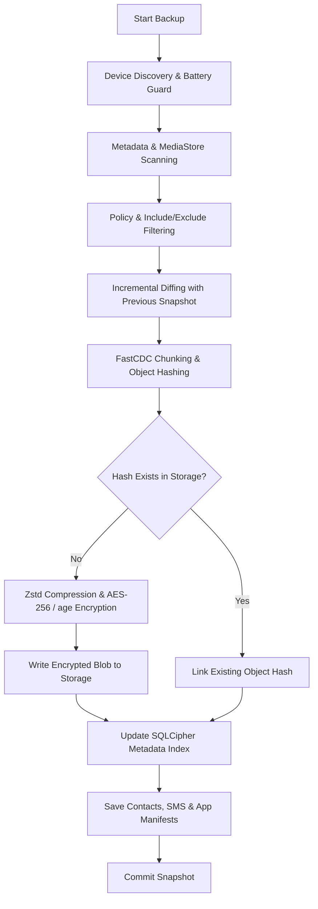

# 🏗 Software Architecture Document (SAD)

## 1. Introduction
This document describes the high-level architecture of the **phone-backup** platform. It is designed to be a secure, storage-efficient, resilient, and multi-transport backup engine for Android devices.

## 2. Architectural Goals
- **Decoupling**: Business logic must be completely independent of external transports (ADB, Wi-Fi Agent) and storage backends (Local Disk, Cloud S3/R2).
- **Security**: Data must be encrypted locally before leaving the device's volatile memory context (*Client-Side Zero-Knowledge*).
- **Efficiency**: Identical files and content chunks are stored only once across all snapshots (*Content-Addressed Storage & FastCDC Deduplication*).
- **Reliability**: Backups must be recoverable and resumable after any hardware or network disconnection (*Fault-Tolerant Streaming Pipeline*).

---

## 3. The Hexagonal Pattern (Ports & Adapters)

The system follows a strict **Hexagonal Architecture**:

```text
                               +-----------------------------+
                               |     apps/cli & apps/gui     |
                               +--------------+--------------+
                                              |
+---------------------------------------------v----------------------------------------------+
|                                    CORE APPLICATION                                        |
|                                                                                            |
|   +------------------------------------------------------------------------------------+   |
|   |                                  BackupService                                     |   |
|   |         (Backup, Restore, Verification, Deduplication, Scanning, Scheduling)       |   |
|   +------------------------------------------+-----------------------------------------+   |
|                                              |                                             |
|        +-------------------+-----------------+-------------------+-------------------+     |
|        |                   |                 |                   |                   |     |
|        v                   v                 v                   v                   v     |
|   [DevicePort]       [ScannerPort]     [StoragePort]     [RepositoryPort]    [AppProvider] |
|        ^                   ^                 ^                   ^                   ^     |
+--------|-------------------|-----------------|-------------------|-------------------|-----+
         |                   |                 |                   |                   |
+--------+-------------------+                 +---------+         +---------+         +-----+
|                                                        |                   |               |
|  ADAPTERS:                                             |                   |               |
|  - AdbAdapter (adapters/adb)                           |                   |               |
|  - AgentAdapter (adapters/agent / Wi-Fi)               |                   |               |
|  - MockAdapter (adapters/mock)                         |                   |               |
|                                                        v                   v               |
|                                                LocalStorage         SqliteRepository       |
|                                                OpenDAL (S3/R2)      (SQLCipher + FTS5)     |
+--------------------------------------------------------------------------------------------+
```

### 🧅 The Core (Domain & Application)
- **Domain (`core/domain`)**: Pure business entities (`Snapshot`, `Device`, `FileEntry`, `ContactData`, `SmsMessage`, `CallLogEntry`). Zero external dependencies.
- **Application (`core/application`)**: The `BackupService` orchestrates the backup, restore, diffing, deduplication, and scanning pipelines. It interacts exclusively through **Ports**.

### 🔌 Ports (Interfaces / Traits)
- `DevicePort`: Hardware detection, battery/thermal monitoring, and file streaming operations.
- `ScannerPort`: Filesystem scanning, metadata discovery, and EXIF/media scraping.
- `StoragePort`: Physical blob storage read/write operations (Local & OpenDAL S3/R2).
- `RepositoryPort`: Relational index, snapshot catalog, FTS5 search, and deduplication map.
- `AppProviderPort` & `DataProviderPort`: Installed applications, APK retrieval, Contacts, SMS, and Call Logs extraction.

### ⚙️ Adapters (Implementations)
- `AdbAdapter (`adapters/adb`)`: Communicates with physical Android hardware over USB/Wi-Fi via Android Debug Bridge.
- `AgentAdapter (`adapters/agent`)`: Wireless communication with the Android Companion APK (`apps/android-agent`) over Wi-Fi.
- `LocalStorage (`adapters/filesystem`)`: Content-addressed object store sharded across local directories.
- `CloudStorage (`adapters/opendal`)`: Seamless object synchronization with AWS S3, Cloudflare R2, and MinIO.
- `SqliteRepository (`infrastructure/database-sqlite`)`: High-performance SQLite database with SQLCipher AES-256 encryption and FTS5 full-text indexing.

---

## 4. Backup Pipeline (Data Flow)



---

## 5. Security Architecture

We implement a **Zero-Knowledge** capable security model:
1. **Key Derivation**: Passwords are never stored in plaintext. We utilize **Argon2id** (32-byte key size, unique salt) via `EncryptionEngine::derive_database_key` to derive 256-bit symmetric keys.
2. **Authenticated Symmetric Encryption**: All data objects and chunks are encrypted using **AES-256-GCM** with unique 96-bit nonces.
3. **Asymmetric Cryptography (age X25519)**: Backups can be locked with a public key (`age1...`), ensuring that automated backup servers cannot decrypt payloads without the offline secret key (`AGE-SECRET-KEY-1...`).
4. **Encrypted Database Engine**: The entire SQLite catalog is protected by **SQLCipher AES-256**, activated automatically via `PRAGMA key` during connection pooling.

---

## 6. Storage Strategy: Content-Addressed Storage (CAS) & FastCDC

Objects are indexed and stored based on their cryptographic SHA-256 hash:
- **Global Deduplication**: If two files share identical content, only one physical object is saved.
- **FastCDC Variable Chunking**: Files exceeding chunking thresholds are segmented into dynamic content-defined chunks, enabling sub-file deduplication.
- **Two-Tier Directory Sharding**: Objects are organized under `objects/ab/cd/...` to ensure smooth filesystem performance across millions of files.

---

## 7. Quality & Test Isolation Architecture

- **100% Pure Production `src/`**: All crate `src/` directories are reserved exclusively for production business logic (zero inline `#[cfg(test)]` modules).
- **Dedicated Test Suites (`tests/`)**: Isolated integration tests (`domain_tests.rs`, `security_compression_test.rs`, `filesystem_adapter_test.rs`, `mock_adapter_test.rs`, `encrypted_repo_test.rs`, `agent_adapter_test.rs`) validate every layer independently.

---
*phone-backup — Engineered with Rust, Clean Architecture, and Military-Grade Security.*
