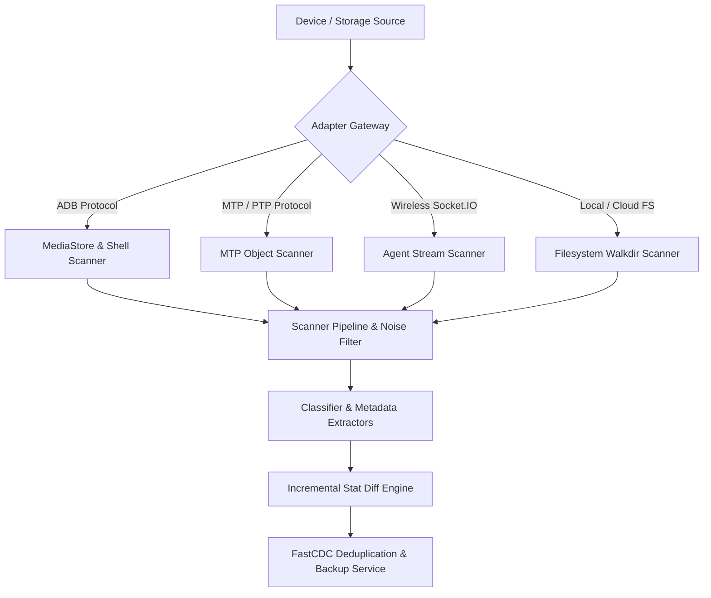
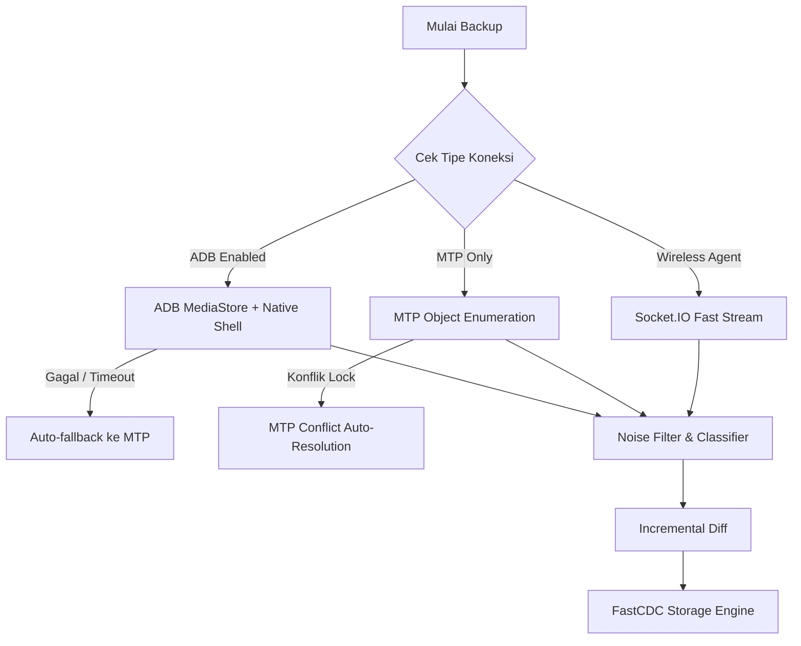

# Phone Backup — Comprehensive Scanner Strategies Architecture

Dokumen ini menjelaskan strategi pemindaian (*Scanner Strategies*) yang digunakan oleh **Phone Backup PRO** untuk mengekstraksi, mengindeks, memfilter, dan mencadangkan setiap tipe data dari perangkat mobile (Android/iOS) maupun sistem berkas lokal.

---

## 1. Arsitektur & Taksonomi Pemindai (*Scanner Taxonomy*)

Sistem pemindaian Phone Backup dirancang dengan prinsip **Clean Architecture**, **Domain-Driven Design (DDD)**, dan pola **Decorator / Pipeline Pattern** di dalam crate [`libs/scanner`](file:///Users/damarkuncoro/antigravity/phone-backup/libs/scanner) dan adapter-adapter terkait.



---

## 2. Matriks Strategi per Kategori Data

| Kategori Data | Adapter / Specialist | Strategi Pemindaian | Sumber Lokasi / Protokol | Kebijakan Filter & Optimasi |
| :--- | :--- | :--- | :--- | :--- |
| **Foto & Gambar** | `phone-backup-image` | `MediaStore` URI Query + EXIF Header Sampling | `content://media/external/images/media` | Pembersihan koordinat GPS sensitif, ekstraksi thumbnail pyramid, blur detection |
| **Video** | `phone-backup-video` | Zero-Copy MP4 Box Header (`moov`/`tkhd`) & MKV EBML | POSIX `/sdcard/DCIM/` & `/sdcard/Movies/` | Resolusi tiering (4K, 1080p, 720p, SD), ekstraksi durasi tanpa membaca seluruh berkas |
| **Audio & Voice Notes** | `phone-backup-audio` | ID3v2/Vorbis Tag Parsing + Waveform Peak Envelope | POSIX `/sdcard/Music/` & Scoped Voice Dirs | Sampling 64-point waveform points, klasifikasi format (Music, VoiceNote, Podcast) |
| **Dokumen & Office** | `phone-backup-documents` | PDF Stream Metadata + Office ZIP XML Analyzer | POSIX `/sdcard/Documents/` & `/sdcard/Download/` | Ekstraksi jumlah halaman, author, software generator, teks ringkas |
| **Kontak (VCF)** | `phone-backup-contacts` | Content Provider Query + `contacts2.db` Parser | `content://com.android.contacts/contacts` | Deduplikasi nama/nomor identik, normalisasi E.164, ekspor vCard 4.0 & CSV |
| **SMS & MMS** | `phone-backup-messages` | Telephony Provider Chunked Query | `content://sms` & `content://mms` | Thread grouping, sanitasi XML/JSON, pencarian teks cepat |
| **Riwayat Panggilan** | `phone-backup-calls` | CallLog Content Provider Query | `content://call_log/calls` | Klasifikasi (Incoming, Outgoing, Missed, Rejected), agregasi total durasi bicara |
| **WhatsApp Chat & Media** | `phone-backup-whatsapp` | Scoped Storage Directory Discovery + Live Web QR | `/storage/emulated/0/Android/media/com.whatsapp/` | Normalisasi media scoped (Images, Video, Voice Notes, Documents), parsing format `[dd/mm/yy] Name: msg` |
| **Telegram Archives** | `phone-backup-telegram` | Desktop & Mobile JSON Chat Indexer | `result.json` & Telegram scoped folders | Klasifikasi media type (Voice, VideoMessage, Sticker, Photo, File), ekspor web viewer |
| **Wi-Fi Credentials** | `phone-backup-wifi` | XML Store Parser & `wpa_supplicant` Discovery | `/data/misc/apexdata/com.android.wifi/WifiConfigStore.xml` | Deteksi enkripsi (WPA2, WPA3, Open, EAP), password masking, QR code connection payload |
| **Browser Bookmarks** | `phone-backup-bookmarks` | Chromium JSON Tree Parser & Netscape HTML | `/data/data/com.android.chrome/app_chrome/Default/Bookmarks` | Ekstraksi folder bersarang, ranking top-domain, ekspor universal HTML |
| **Notes & Checklists** | `phone-backup-notes` | Google Keep JSON & Markdown Checklist Crawler | POSIX Notes folders & Keep Takeout | Parsing status periksa `[x]` / `[ ]`, ekstraksi tag `#kategori` |

---

## 3. Strategi Pemindaian Berkas Tingkat Lanjut

### A. Incremental Stat-based Diffing (`IncrementalScanner`)
Sebelum berkas dibaca dan di-hash (SHA-256), pemindai membandingkan metadata status:
1. `file_size`: Ukuran berkas dalam bytes.
2. `modified_time`: Waktu perubahan terakhir POSIX timestamp.
3. `device_path`: Path lengkap berkas pada perangkat.

Jika `(file_size, modified_time)` identik dengan snapshot sebelumnya, berkas ditandai **`Unmodified`** dan hash referensi digunakan kembali secara instan tanpa transfer data.

### B. Noise & Cache Filtering (`NoiseFilter`)
Pemindai otomatis mengabaikan berkas sampah sistem untuk menghemat ruang dan mempercepat backup:
- **Thumbnail Cache**: `**/.thumbnails/**`, `**/thumbs.db`, `**/.DS_Store`
- **Application Cache**: `**/cache/**`, `**/tmp/**`, `**/*.tmp`
- **Socket & FIFO**: Berkas pipe POSIX dan socket IPC Android.

### C. FastCDC Chunking & Deduplication
Untuk berkas berukuran besar (misalnya database obrolan, video, zip):
1. Berkas dipecah menjadi chunk variabel menggunakan **FastCDC (Fast Content-Defined Chunking)** dengan target rata-rata **64 KB**.
2. Setiap chunk di-hash menggunakan SHA-256 dan diperiksa pada repository global SQLite.
3. Hanya chunk baru (unik) yang dikompresi (Zstandard) dan dienkripsi (ChaCha20-Poly1305 / AES-256-GCM).

---

## 4. Fallback & Resilience Strategy



---

## 5. Ringkasan Penggunaan di CLI & GUI

- **CLI Direct Scan**:
  ```bash
  phone-backup scan <device-id> --category photos,videos,documents
  phone-backup wifi <device-id> --qr "MyNetwork"
  phone-backup bookmarks <device-id> --export-html bookmarks.html
  ```
- **GUI Integration**:
  - Halaman **Dashboard**: Menampilkan total logical bytes dan rasio efisiensi deduplikasi.
  - Halaman **Data Vault**: Menampilkan visualisasi data spesialis (Wi-Fi, Bookmarks, Notes, Calendar).
  - Halaman **File Browser**: Menampilkan struktur direktori live hasil penjelajahan pemindai.
