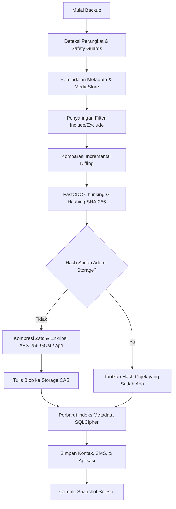

# 🏗 Architecture & Design

Platform **phone-backup** dirancang menggunakan arsitektur modular bertingkat tinggi dengan mematuhi prinsip **Clean Architecture**, **Hexagonal Architecture (Ports & Adapters)**, dan **SOLID Principles**.

---

## 1. Hexagonal Architecture (Ports & Adapters)

Tujuan utama dari arsitektur heksagonal adalah memisahkan seluruh aturan bisnis inti (*Core Domain & Application Logic*) dari implementasi teknologi luar (*Hardware Transports, Database, Cloud Backends*).

```text
                                  +-----------------------------+
                                  |     apps/cli & apps/gui     |
                                  +--------------+--------------+
                                                 |
+------------------------------------------------v-----------------------------------------------+
|                                       CORE APPLICATION                                         |
|                                                                                                |
|   +----------------------------------------------------------------------------------------+   |
|   |                                     BackupService                                      |   |
|   |          (Backup, Restore, Verification, Deduplication, Scanning, Scheduling)          |   |
|   +--------------------------------------------+-------------------------------------------+   |
|                                                |                                               |
|        +---------------------+-----------------+---------------------+-------------------+     |
|        |                     |                 |                     |                   |     |
|        v                     v                 v                     v                   v     |
|   [DevicePort]         [ScannerPort]     [StoragePort]       [RepositoryPort]    [AppProvider]   |
|        ^                     ^                 ^                     ^                   ^     |
+--------|---------------------|-----------------|---------------------|-------------------|-----+
         |                     |                 |                     |                   |
+--------+---------------------+                 +---------+           +---------+         +-----+
|                                                          |                     |               |
|  ADAPTERS:                                               |                     |               |
|  - AdbAdapter (USB ADB)                                  |                     |               |
|  - AgentAdapter (Wi-Fi Companion Agent)                  |                     |               |
|  - MockAdapter (Testing)                                 |                     |               |
|                                                          v                     v               |
|                                                   LocalStorage          SqliteRepository       |
|                                                   OpenDAL (S3/R2)       (SQLCipher + FTS5)     |
+------------------------------------------------------------------------------------------------+
```

---

## 2. Struktur Workspace Rust

```text
phone-backup/
├── apps/
│   ├── cli/                     # Command Line Interface (Composition Root)
│   ├── gui/                     # Desktop GUI (Tauri Backend & Frontend Web Components)
│   └── android-agent/           # Native Android Companion APK (Kotlin)
├── core/
│   ├── domain/                  # Entitas bisnis murni (Snapshot, Device, FileEntry)
│   ├── application/             # Use cases & BackupService orchestration
│   └── ports/                   # Definisi interface trait (DevicePort, StoragePort, dll.)
├── adapters/
│   ├── adb/                     # Adapter komunikasi hardware ADB
│   ├── agent/                   # Adapter protokol nirkabel Android Agent
│   ├── filesystem/              # Adapter CAS local storage
│   ├── opendal/                 # Adapter cloud object storage (S3/R2)
│   └── mock/                    # In-memory mock adapter untuk unit tests
└── infrastructure/
    └── database-sqlite/         # Relational catalog terenkripsi SQLCipher + FTS5
```

---

## 3. Alur Data Backup (Data Pipeline)



---

## 4. Prinsip Desain Utama

1. **Single Responsibility Principle (SRP)**: Setiap crate dan modul memiliki satu tanggung jawab spesifik (misal: `ObjectManager` menangani transformasi hashing & enkripsi, `SqliteRepository` menangani persistensi relasional).
2. **Dependency Inversion Principle (DIP)**: `BackupService` hanya bergantung pada trait abstraksi `ports::*`, bukan pada pustaka eksternal seperti Rusqlite atau ADB.
3. **Zero-Copy Streaming**: Aliran data dari perangkat diteruskan langsung ke pipeline enkripsi dan storage tanpa membuat berkas sementara yang membebani SSD.
4. **Test Isolation (Pure `src/`)**: 100% file kode produksi tidak tercampur dengan blok pengujian, seluruh suite pengujian ditempatkan terisolasi di folder `tests/`.

---

## 5. Pola Desain (Design Patterns) Terapan

| Pola Desain | Komponen | Tujuan & Manfaat |
| :--- | :--- | :--- |
| 🏗 **Builder Pattern** | `BackupServiceBuilder`, `RestoreOptionsBuilder`, `BackupPolicyBuilder` | Konstruksi objek orkestrator dan opsi konfigurasi yang fleksibel, *type-safe*, dan tanpa parameter berlebih (*fluent API*). |
| 🏭 **Factory Pattern** | `StorageFactory` | Instansiasi polimorfik berbagai backend penyimpanan (Local FileSystem, S3, GCS, Azure Blob) dari konfigurasi/URI. |
| 🛡 **Decorator Pattern** | `RetryStorage`, `MetricsStorage` | Membungkus `StoragePort` untuk menambahkan kemampuan *auto-retry with exponential backoff* dan observabilitas metrik I/O tanpa menyentuh *core logic*. |
| 📡 **Observer Pattern** | `DomainEventBus`, `DomainEventHandler` | Menerbitkan event siklus hidup (`BackupStarted`, `BackupCompleted`, `BackupFailed`) secara *loose-coupled* ke GUI, notifikasi OS, dan audit log. |
| 🛑 **Cooperative Cancellation** | `CancellationToken` | Mekanisme pembatalan aman antar-thread di setiap checkpoint batch transfer data. |

---
*Lanjutkan ke: [Security & Encryption](Security-and-Encryption.md) atau [Storage & Deduplication](Storage-and-Deduplication.md).*
